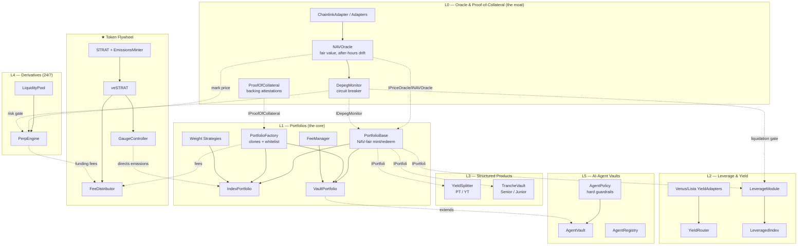

# Stratum Protocol — Architecture

Stratum turns tokenized equities (Binance **bStocks** on BNB Chain) into composable, leverageable,
tranche-able, AI-manageable assets. The stack is built in layers; **higher layers depend only on the
interfaces of lower layers** (`src/interfaces/`), never on concrete implementations — so each layer is
independently testable and upgradeable.

## Layer dependency graph

## Interface boundaries

| Interface | Defined by | Consumed by |
|---|---|---|
| `IPriceOracle` / `INAVOracle` | L0 `NAVOracle` | L1 `PortfolioBase`, L2 `LeverageModule`, L4 `PerpEngine`, strategies |
| `IProofOfCollateral` | L0 `ProofOfCollateral` | L1 `PortfolioFactory` (whitelist) |
| `IDepegMonitor` | L0 `DepegMonitor` | L1 mint/redeem, L2 liquidations, L4 opens |
| `ISwapRouter` | adapter (PancakeSwap) | L1 allocation/rebalance, L2 deleverage |
| `IWeightStrategy` | L1 strategies | `IndexPortfolio.rebalance` |
| `IPortfolio` | L1 `PortfolioBase` | L2/L3/L4 wrappers |
| `IYieldAdapter` / `IMoneyMarket` | L2 adapters | `YieldRouter` |
| `IFeeManager` | L1 `FeeManager` | `VaultPortfolio`, structured products |

## Cross-cutting safety model

- **One circuit breaker.** `DepegMonitor.isTradingSafe(asset)` is the single pre-trade gate consulted
  before every mint/redeem/leverage-open/perp-open/liquidation. A tripped breaker (manual halt, oracle
  stale, or DEX↔NAV depeg over threshold) blocks new risk — and blocks liquidations so positions are
  never closed on bad prices.
- **Oracle-independent exits.** L1 `redeem` (and L3 in-kind settlement) never read prices, so users can
  always exit even if the oracle is stale or the contract is paused.
- **NAV-fair accounting.** Mint shares = depositValue · supply / NAV; redeem is pro-rata in-kind. The
  `fully-backed` and `arbitrage-peg` invariants are fuzzed over 100k+ calls.
- **Conservation invariants.** Perp PnL conservation, tranche waterfall priority, PT+YT reconstruction,
  yield no-value-lost, and fee no-double-claim are each enforced by invariant/fuzz tests.
- **Guardrails over trust.** AI agents (`AgentVault`) propose; `AgentPolicy` disposes — whitelist, max
  position, epoch turnover and a drawdown kill switch the agent can never widen (timelocked governance).
